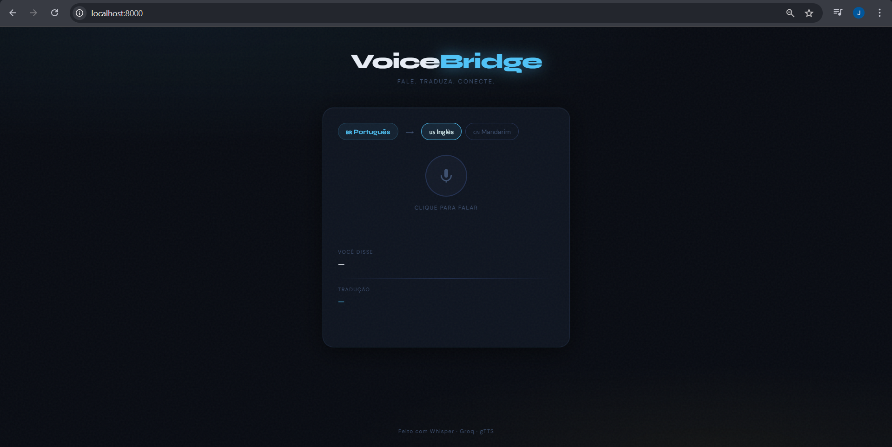
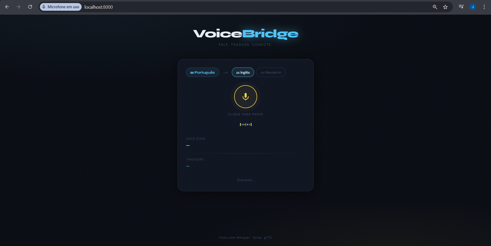
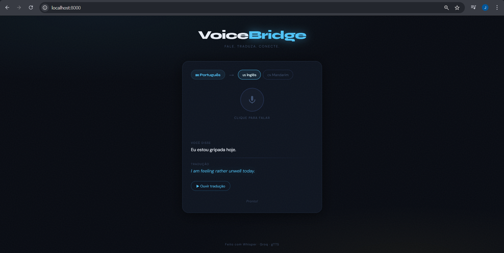
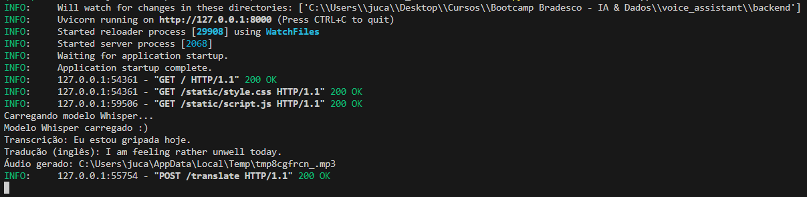

# VoiceBridge — Tradutor de Voz com IA

VoiceBridge é uma aplicação web full stack que combina reconhecimento de fala, inteligência artificial e síntese de voz para traduzir áudio em tempo real. Desenvolvido como projeto do Bootcamp de IA & Dados da DIO/Bradesco.

---

## Interface

**Tela inicial**


**Gravando voz**


**Resultado da tradução**


**Backend em ação**


---

## Funcionalidades

- **Gravação de voz** direto pelo navegador
- **Transcrição automática** com OpenAI Whisper
- **Tradução inteligente** com Groq (LLaMA 3.1)
- **Resposta em áudio** sintetizada com Google Text-to-Speech (gTTS)
- Português para **Inglês**
- Português para **Mandarim**

---

## Tecnologias

| Camada | Tecnologia |
|--------|-----------|
| Backend | Python 3.11 + FastAPI |
| Transcrição | OpenAI Whisper (`small`) |
| Tradução | Groq API (LLaMA 3.1 8B) |
| Síntese de voz | gTTS (Google Text-to-Speech) |
| Frontend | HTML + CSS + JavaScript (vanilla) |
| Servidor | Uvicorn (ASGI) |

---

## Estrutura do Projeto
```
voicebridge/
├── assets/
│   └── screenshots/
│       ├── interface.png
│       ├── escutando.png
│       ├── resultado.png
│       └── api-backend.png
├── backend/
│   ├── main.py                  # API FastAPI — endpoints principais
│   └── services/
│       ├── __init__.py
│       ├── transcriber.py       # Transcrição com Whisper
│       ├── translator.py        # Tradução com Groq
│       └── speaker.py           # Síntese de voz com gTTS
├── frontend/
│   ├── index.html               # Interface do usuário
│   ├── style.css                # Estilos (tema escuro)
│   └── script.js                # Lógica de gravação e comunicação com API
├── .env.example
├── .gitignore
├── requirements.txt
└── README.md
```

---

## Pré-requisitos

- [Python 3.11](https://www.python.org/downloads/release/python-3119/)
- [FFmpeg](https://www.gyan.dev/ffmpeg/builds/) instalado e configurado no PATH do sistema
- Chave de API da [Groq](https://console.groq.com/) (gratuita)

### Instalando o FFmpeg no Windows

1. Baixe o `ffmpeg-release-essentials.zip` em [gyan.dev/ffmpeg/builds](https://www.gyan.dev/ffmpeg/builds/)
2. Extraia e mova a pasta para `C:\ffmpeg`
3. Adicione `C:\ffmpeg\<nome-da-pasta>\bin` às variáveis de ambiente do sistema (PATH)
4. Reinicie o terminal e verifique com `ffmpeg -version`

---

## Como Rodar Localmente

**1. Clone o repositório**
```bash
git clone https://github.com/seu-usuario/voicebridge.git
cd voicebridge
```

**2. Crie e ative o ambiente virtual**
```bash
python -m venv venv

# Windows
venv\Scripts\activate

# Mac/Linux
source venv/bin/activate
```

**3. Instale as dependências**
```bash
python -m pip install --upgrade pip setuptools wheel
pip install -r requirements.txt
```

**4. Configure a chave de API**

Crie um arquivo `.env` na pasta `backend/` com base no `.env.example`:
```
GROQ_API_KEY=sua_chave_aqui
```

Obtenha sua chave gratuita em [console.groq.com](https://console.groq.com/).

**5. Inicie o servidor**
```bash
cd backend
python -m uvicorn main:app --reload
```

**6. Acesse no navegador**
```
http://localhost:8000
```

---

## Como Usar

1. Selecione o idioma de destino (Inglês ou Mandarim)
2. Clique no botão do microfone e fale em português
3. Clique novamente para parar a gravação
4. Aguarde o processamento — a transcrição e a tradução aparecem na tela
5. Clique em **"Ouvir tradução"** para ouvir o áudio traduzido

---

## Endpoints da API

| Método | Rota | Descrição |
|--------|------|-----------|
| `GET` | `/` | Interface web |
| `POST` | `/translate` | Recebe áudio, retorna transcrição + tradução + áudio |
| `GET` | `/audio/{filename}` | Serve o arquivo de áudio gerado |
| `GET` | `/health` | Status da API |

### Exemplo de resposta do `/translate`
```json
{
  "transcription": "Eu estou gripada hoje.",
  "translation": "I am feeling rather unwell today.",
  "audio_url": "/audio/tmpXYZ.mp3"
}
```

---

## Arquitetura do Fluxo
```
Usuário fala
     ↓
[Browser] Grava áudio via MediaRecorder API
     ↓
[FastAPI] Recebe o arquivo .wav
     ↓
[Whisper] Transcreve o áudio → texto em português
     ↓
[Groq / LLaMA 3.1] Traduz o texto para o idioma escolhido
     ↓
[gTTS] Sintetiza a tradução em áudio .mp3
     ↓
[Browser] Exibe transcrição + tradução + reproduz o áudio
```

---

## Segurança

- A chave de API é carregada via variável de ambiente (`.env`)
- O arquivo `.env` está no `.gitignore` e **nunca é enviado ao GitHub**
- Use o `.env.example` como referência pública

---

## Dependências Principais
```
fastapi==0.111.0
uvicorn==0.29.0
python-multipart==0.0.9
groq==0.9.0
httpx==0.27.0
openai-whisper
gtts==2.5.1
python-dotenv==1.0.1
```

---

## Contexto Acadêmico

Projeto desenvolvido como conclusão do **Bootcamp de IA & Dados — DIO/Bradesco**, expandindo o laboratório de integração entre Whisper, ChatGPT e gTTS com:

- Interface web full stack (FastAPI + HTML/CSS/JS)
- Substituição do ChatGPT pela API da Groq (LLaMA 3.1) — gratuita e de alta performance
- Suporte a tradução para Mandarim

---

## Autor

Feito por Júlia Campos, ou Juca! :D

[](https://www.linkedin.com/in/julia-campos-dev/)
[](https://github.com/juccca)